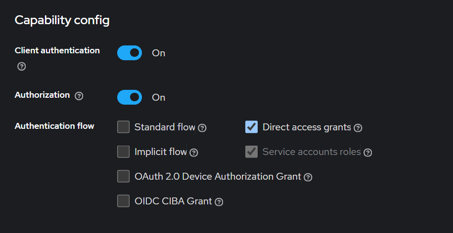
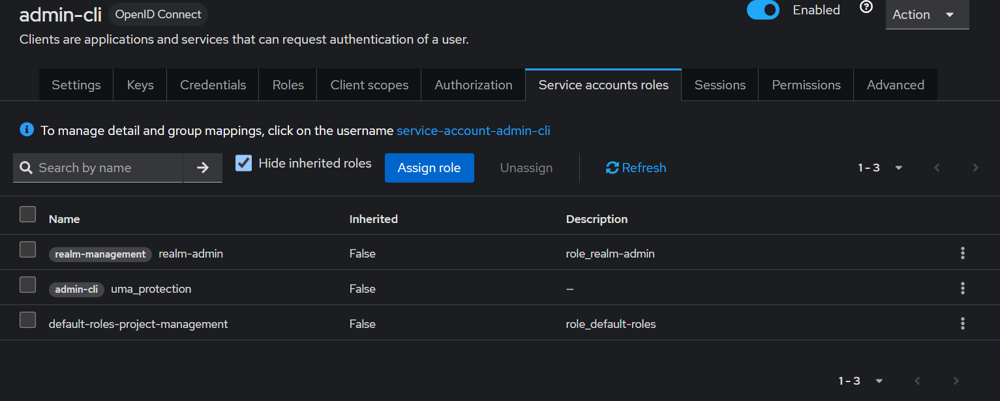

# Create user programmatically

## Keycloak setup

To enable keycloak to allow creating user and roles from our backend app, we need to give **realm-admin** role to **admin-cli** client.

#### Enable client authentication and authorization for admin-cli.

Navigate to **Clients** -> **admin-cli** -> **Settings**

Enable **Client authentication** and **Authorization**



Assign **realm-admin** role to **admin-cli** from **Service account roles** tab



After this configuration you can create user and role from your backend app.

## Code to create User and Roles

```java
    @Value("${keycloak.config.auth-server-url}")
    private String serverUrl;

    @Value("${keycloak.config.realm}")
    private String realm;

    @Value("${keycloak.config.admin-client-id}")
    private String adminClientId;

    @Value("${keycloak.config.admin-client-secret}")
    private String adminClientSecret;

    private Keycloak getAdminKeycloakInstance() {
        return KeycloakBuilder.builder()
                .serverUrl(serverUrl)
                .realm(realm)
                .clientId(adminClientId)
                .clientSecret(adminClientSecret)
                .grantType(OAuth2Constants.CLIENT_CREDENTIALS)
                .build();
    }

    // Create user
    private UserRepresentation createUser(String username, String password, String email, String firstName, String lastName, String roleName) {
        Keycloak keycloak = getAdminKeycloakInstance();
        RealmResource realmResource = keycloak.realm(realm);
        UsersResource usersResource = realmResource.users();

        // Set user details
        UserRepresentation user = new UserRepresentation();
        user.setUsername(username);
        user.setEmail(email);
        user.setFirstName(firstName);
        user.setLastName(lastName);
        user.setEnabled(true);

        // Set password credentials
        CredentialRepresentation credential = new CredentialRepresentation();
        credential.setType(CredentialRepresentation.PASSWORD);
        credential.setValue(password);
        credential.setTemporary(false);
        user.setCredentials(Collections.singletonList(credential));

        user.setRealmRoles(Collections.singletonList(roleName));

        Response response = usersResource.create(user);

        // Get created user ID from response
        String location = response.getLocation().toString();
        String userId = location.substring(location.lastIndexOf('/') + 1);

        assignRealmRole(userId, roleName, realmResource);

        return user;
    }

    // Assign role to user
    private void assignRealmRole(String userId, String roleName, RealmResource realmResource) {
        RoleRepresentation role = realmResource.roles().get(roleName).toRepresentation();
        realmResource.users().get(userId).roles().realmLevel().add(Collections.singletonList(role));
    }

    // Create role
    private void createRole(String roleName) {
        Keycloak keycloak = getAdminKeycloakInstance();
        RolesResource rolesResource = keycloak.realm(realm).roles();

        RoleRepresentation roleRepresentation = new RoleRepresentation();
        roleRepresentation.setName(roleName);
        roleRepresentation.setClientRole(false);
        roleRepresentation.setComposite(false);
        roleRepresentation.setAttributes(Collections.emptyMap());
        roleRepresentation.setDescription(roleName + " role");

        // Create the role
        rolesResource.create(roleRepresentation);
    }

    private void createUserAndRole() {
            createRole(Roles.ADMIN);
            createRole(Roles.USER);

            createUser("admin", "Admin", "admin@gmail.com", "admin", "admin", Roles.ADMIN);
            createUser("shivam", "Shivam$456", "shivampatelce@gmail.com", "Shivam", "Patel", Roles.USER);
    }
```
