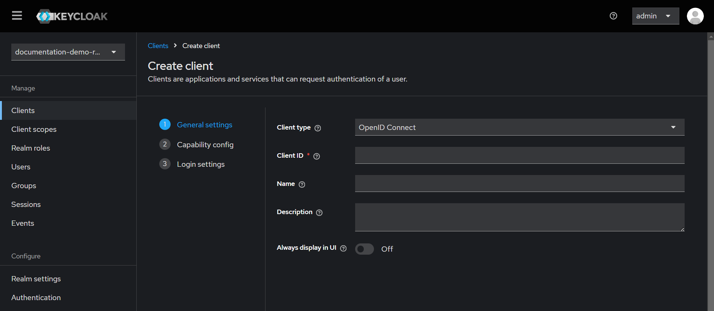
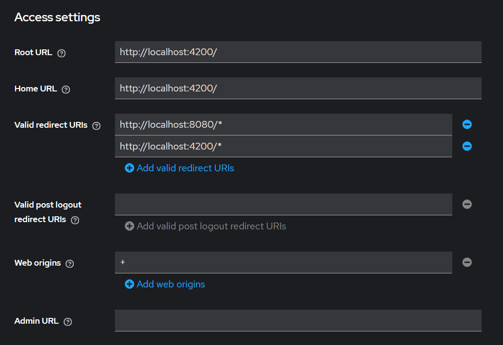
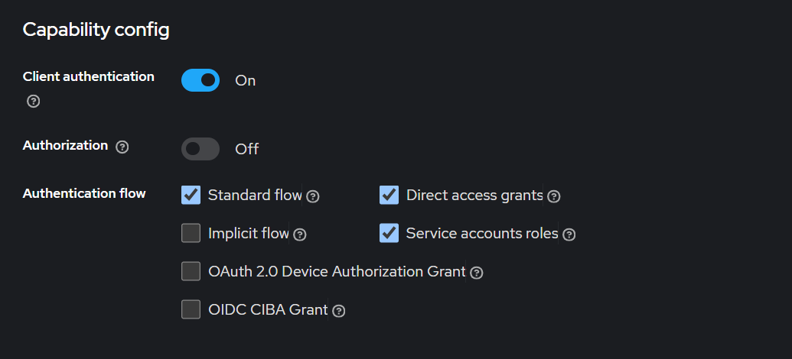
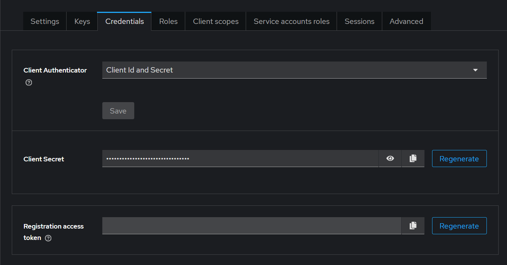

### Keycloak startup configurations

After logging in as an admin, first create a realm, then set up a client to connect your backend and frontend applications with Keycloak.

Set Valid redirect URIs and set Web origins

After these configurations, you can create new roles and users for your application.

### Generate admin cli credentials

Step-1: Select admin-cli from client list and then enable Client authentication for admin-cli client.

Step-2: After enabling client authentication you can generate client secrets.

