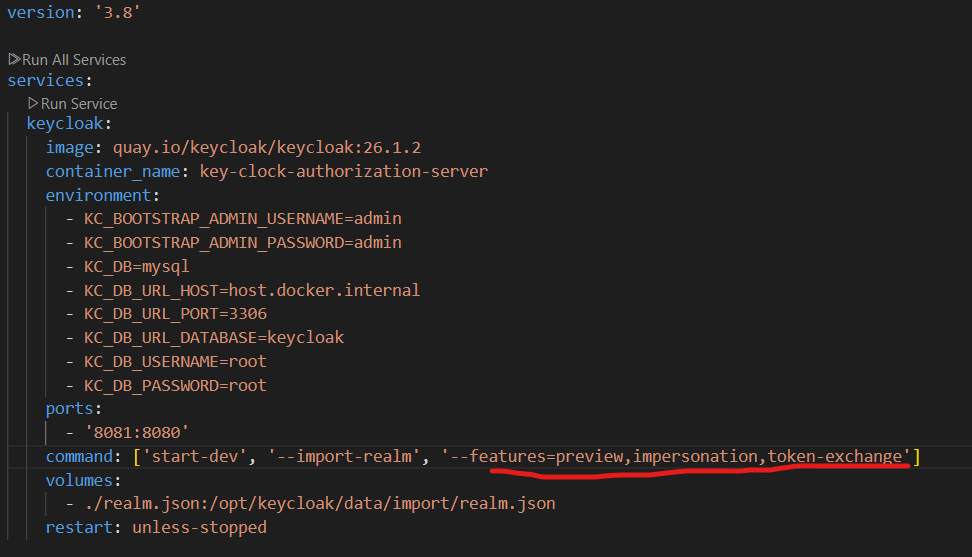
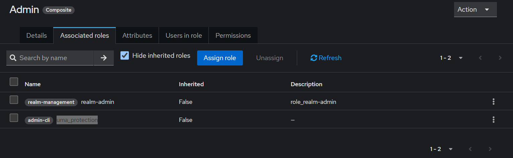
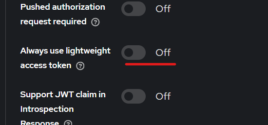
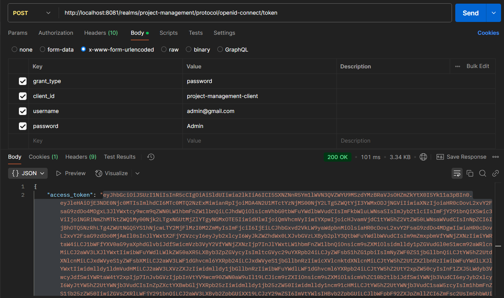
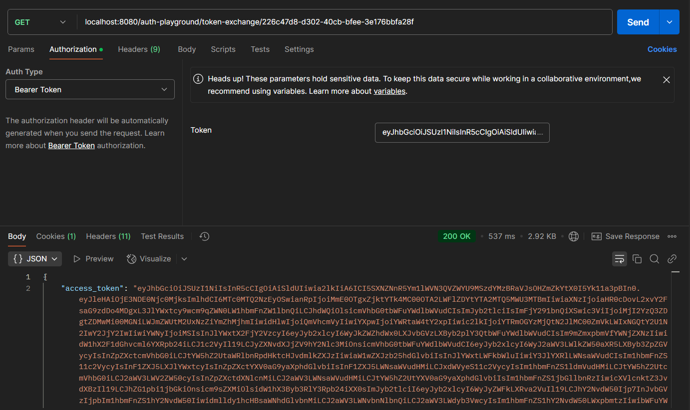

# Token Exchange

## Keycloak Setup

#### Step-1: Enable token exchange feature



```yaml
version: '3.8'

services:
  keycloak:
    image: quay.io/keycloak/keycloak:26.1.2
    container_name: key-clock-authorization-server
    environment:
      - KC_BOOTSTRAP_ADMIN_USERNAME=admin
      - KC_BOOTSTRAP_ADMIN_PASSWORD=admin
      - KC_DB=mysql
      - KC_DB_URL_HOST=host.docker.internal
      - KC_DB_URL_PORT=3306
      - KC_DB_URL_DATABASE=keycloak
      - KC_DB_USERNAME=root
      - KC_DB_PASSWORD=root
    ports:
      - '8081:8080'
    command:
      [
        'start-dev',
        '--import-realm',
        '--features=preview,impersonation,token-exchange',
      ]
    volumes:
      - ./realm.json:/opt/keycloak/data/import/realm.json
    restart: unless-stopped
```

#### Step-2: Create Roles: Admin, User

Assign the **realm-admin** and **uma_protection** roles to the **admin** role to enable token exchange for the admin user.



#### Step-3: Create users with Admin role and User role

```
username: admin@gmail.com
role: Admin

username: shivampatelce@gmail.com
role: User
```

#### Step-4: Disable lightweight access token feature

Lightweight access token feature prevents the inclusion of roles in the access token during token exchange.

1. Navigate to the <b>Clients</b> section
2. Select <b>admin-cli</b> from the list of clients.
3. Go to the <b>Advanced</b> tab.
4. In the <b>Advanced Settings</b> section, disable the <b>Always use lightweight access token</b> option.



## Backend setup

#### Step-1: Created end point for token exchange, which accept user-id as a path variable and admin token as a Authorization header.

```java

    @GetMapping("/token-exchange/{userId}")
    @PreAuthorize("hasRole('admin')")
    public AccessTokenResponse exchangeToken(@RequestHeader("Authorization") String authorizationHeader,
                                             @PathVariable("userId") String userId) {
        String token = authorizationHeader.replace("Bearer ", "");
        return keyCloakService.exchangeToken(userId, token);
    }

```

#### Step-2: Logic for token exchange

Here we need admin-cli client id and secret.

```java

    public AccessTokenResponse exchangeToken(String userId, String adminToken) {
        Form form = new Form();
        form.param("grant_type", "urn:ietf:params:oauth:grant-type:token-exchange");
        form.param("client_id", adminClientId);
        form.param("client_secret", adminClientSecret);
        form.param("subject_token", adminToken);
        form.param("requested_token_type", "urn:ietf:params:oauth:token-type:access_token");
        form.param("requested_subject", userId);
        form.param("scope", "openid profile email roles permissions");

        Response response = ClientBuilder.newClient()
                .target(serverUrl + "/realms/" + realm + "/protocol/openid-connect/token")
                .request(MediaType.APPLICATION_JSON)
                .post(Entity.form(form));

        return response.readEntity(AccessTokenResponse.class);
    }

```

## How I tested the token exchange flow

#### Step-1: Obtained an admin token using admin user credentials.



```
URI: http://localhost:8081/realms/project-management/protocol/openid-connect/token

Type: x-www-form-urlencoded

Payload:
{
    grant_type -> password
    client_id -> project-management-client
    username -> admin@gmail.com
    password -> Admin
}

```

#### Step-2: Using the user ID of shivampatelce@gmail.com ('226c47d8-d302-40cb-bfee-3e176bbfa28f' in my case) and the admin's access token, I obtained an access token for shivampatelce@gmail.com.



Using this access token, admin can access app as shivampatelce@gmail.com

```
URI: localhost:8080/auth-playground/token-exchange/{user-id}

Add Admin Access Token
```

#### Decoded access token:

**The token also includes information about the impersonating user.**

```json
{
  "exp": 1741458595,
  "iat": 1741458295,
  "jti": "ef3aceb2-a095-426f-8f89-ef61024e5bec",
  "iss": "http://localhost:8081/realms/project-management",
  "aud": ["realm-management", "broker", "account"],
  "sub": "226c47d8-d302-40cb-bfee-3e176bbfa28f",
  "typ": "Bearer",
  "azp": "admin-cli",
  "sid": "52b6d70c-0009-40a8-bccb-26684bfc8231",
  "acr": "1",
  "realm_access": {
    "roles": ["default-roles-project-management", "user"]
  },
  "resource_access": {
    "realm-management": {
      "roles": []
    },
    "admin-cli": {
      "roles": ["uma_protection"]
    },
    "broker": {
      "roles": []
    },
    "account": {
      "roles": []
    }
  },
  "scope": "email profile",
  "email_verified": false,
  "name": "Shivam Patel",
  "impersonator": {
    "id": "4db6fa19-ed53-4696-814e-26ea824c1919",
    "username": "admin@gmail.com"
  },
  "preferred_username": "shivampatelce@gmail.com",
  "given_name": "Shivam",
  "family_name": "Patel",
  "email": "shivampatelce@gmail.com"
}
```
